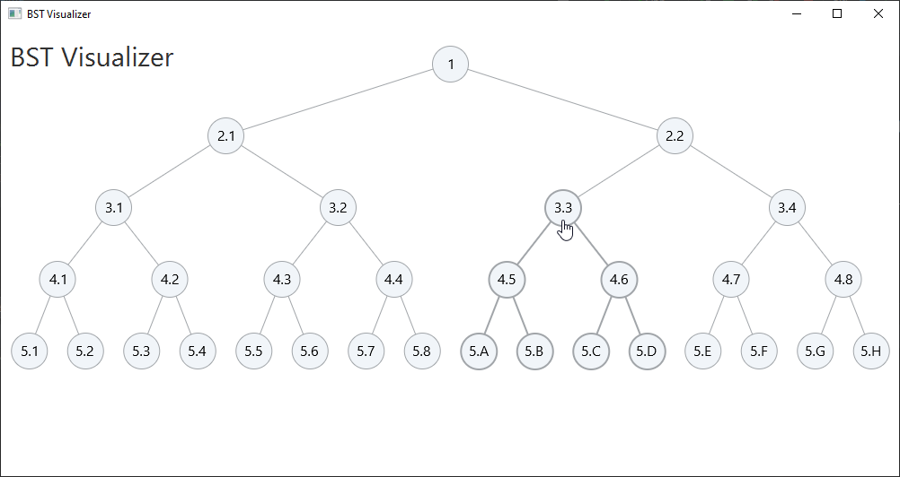

# BST Visualizer

***UNDER CONSTRUCTION***
<!-- Binary [Search]? Tree Visualizer, Traversal computer, ...etc for local / offline use as a desktop application. -->

Building with <i style="color: red">&hearts;</i> in JavaFX by IntelliJ applying MVVM.

### Features

- Visualizer
- Traverse computer
- Draggable nodes (lonely and recursively)

  *COMING SOON...*

*Initial screenshot*

